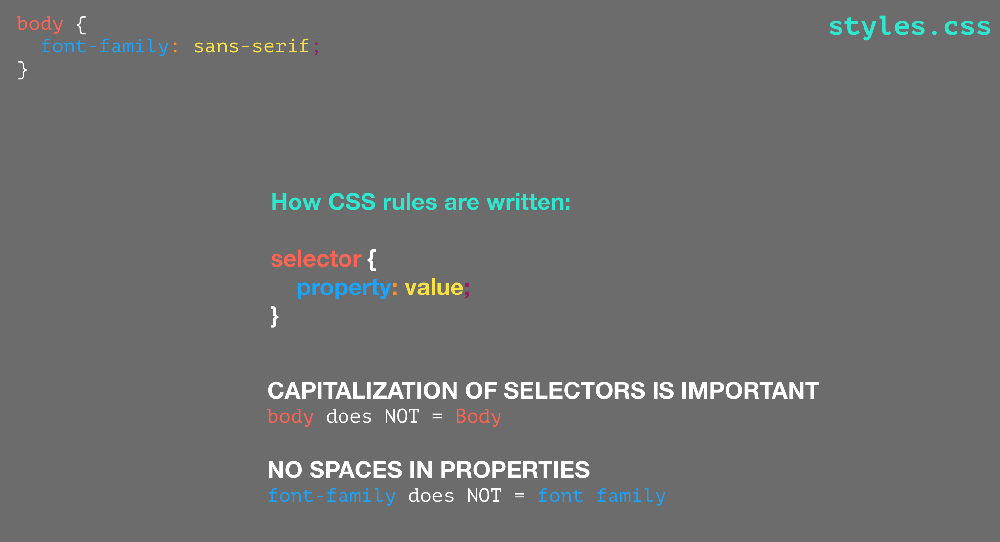
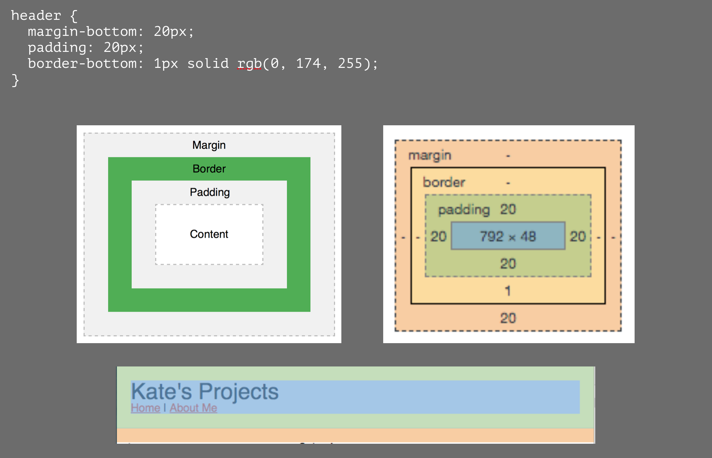

# Intro to HTML and CSS 

Companion site to my _Intro to HTML and CSS_ unit for BHS. Visit https://craftykate.github.io/bhs-sample-project-site/ to see the site we will be building live.

**Pre-Class Requests:**

- Create a GitHub account, check your email and verify your email with them
- Take two screenshots of two project (one screenshot each) and name them something meaningful like "penguin_scratch_game.png"
- (The below are not needed when using repl.it instead of a downloaded IDE. If using repl, create an account and verify email if needed.)
- ~~Download VS Code https://code.visualstudio.com~~
- ~~Make a "my-projects" folder on your computer with an "img" folder inside that. Inside the img folder please put screenshots of 2 projects.~~
  - ~~**Tips:** make "my-projects" and the names of your screenshots one word. Name your screenshots something short and meaningful like "penguin-scratch-game.png".~~

## Reset File

<a href="https://meyerweb.com/eric/tools/css/reset/">Eric Meyer's Reset CSS</a> Copy the code in the salmon-colored box and paste it in your reset.css file

## Color Picker

<a href="http://katescolorpicker.surge.sh/">Color Picker</a> Hover over a color to get rgb and hex codes

## Temporary "About Me" Pictures
Don't have a profile pic saved on your computer yet? Use one of these fabulous temporary profile pics I picked out just for you! Copy the link below of the image you want and put that in your image tag's source.  

  

1. https://images.pexels.com/photos/50582/selfie-monkey-self-portrait-macaca-nigra-50582.jpeg
1. https://images.pexels.com/photos/208821/pexels-photo-208821.jpeg
1. https://images.pexels.com/photos/288621/pexels-photo-288621.jpeg 

## Further Resources 

1. **FULL CODE:** Full HTML and CSS code here on my GitHub repository (https://github.com/craftykate/bhs-sample-project-site). I encourage you to modify your code! Feel safe knowing if you totally mess up and need to start over you can come back here to get the full code of what we did in class - you'll just need to put your own details back in. 
1. **CODE VALIDATING:**  
Visit https://validator.w3.org/#validate_by_input to validate your HTML  
Visit http://www.css-validator.org/#validate_by_input to validate your CSS  
This is ALWAYS a good idea before sending your code out into the wild
1. **REFERENCE:** Looking to learn more about a particular HTML or CSS feature? Start with W3Schools.com for <a href="https://www.w3schools.com/html/default.asp">HTML</a> or <a href="https://www.w3schools.com/css/default.asp">CSS</a>
1. **CHEAT SHEET:** A great HTML CheatSheet! https://htmlcheatsheet.com
1. **GIT:** If you are going to be doing more programming I highly recommend doing a <a href="https://lab.github.com/githubtraining/introduction-to-github">quick tutorial on git</a>. Save your program as you go with git and easily roll back to previous saves if something goes horribly wrong. Which it will.
1. **CHROME:** Chrome is an excellent developer browser! View > Developer > Developer Tools will show the html of any website. I highly recommend becoming familiar with Chrome's developer tools if you are going to build sites
1. **STACK OVERFLOW:** Stuck on a problem you can't solve? Trying to do something beyond your capabilities? <a href="https://stackoverflow.com">Stack Overflow</a> is an excellent resource of questions and answers from the community.
1. **CAN I USE:** Not all browsers support all CSS features the same way. Search on <a href="https://caniuse.com/#home">CanIUse.com</a> for a particular feature to see which browsers support it, what percentage of users are covered and which features you need to write with prefixes for better support.
1. **FURTHER TUTORIALS:** Try codecademy for free tutorials on <a href="https://www.codecademy.com/learn/learn-html">HTML</a> and <a href="https://www.codecademy.com/learn/learn-css">CSS</a> to expand your knowledge
1. **LADIES!** Did you know <a href="https://www.npr.org/sections/alltechconsidered/2014/10/06/345799830/the-forgotten-female-programmers-who-created-modern-tech">women were the first programmers</a>?? In a recent study of over 3 MILLION pull requests on github (peer-reviewed code) the <a href="https://www.theguardian.com/technology/2016/feb/12/women-considered-better-coders-hide-gender-github">code written by women</a> was approved at a higher rate than code written by men. See more <a href="https://www.hackerearth.com/blog/developers/top-women-programmers-history/">top women programmers</a>. Women make excellent programmers and the tech world needs you! Check out <a href="https://girlswhocode.com/">girlswhocode</a> for more resources just for you!

## Helpful Slides

Sample website with external css:  

CSS syntax:  

Difference between margin and padding:  

## GitHub Tips:

- You can edit your files right in GitHub! When it's time to add a new project you can either edit the index.html file on your computer, save it, then drag it into GitHub just like you did the first time, or you can edit the index.html file in GitHub. Just remember that if you edit a file on GitHub your computer file will be behind.
- Sometimes it can take a little while for your browser and/or GitHub to update when you make a change. So, if you edit the CSS file to make your background blue it might take 10 minutes for your website to reflect that. This is the downside to editing your files in GitHub - when you edit on your computer you can preview immediately the changes you made in Chrome. 
- The live link to your site is going to be: USERNAME.github.io/REPOSITORY-NAME

## Follow up for Sep 2018 class:

1. **href = “hypertext reference”** Incredibly interesting article on what href stands for (seems like lots of people have wondered this) here: https://tomayko.com/blog/2008/wtf-is-an-href-anyway
1. To add hover text to an image: 
1. **AngularJS vs ReactJS vs NodeJS**: there are some great articles! Like https://www.markupbox.com/blog/angularjs-vs-reactjs-vs-nodejs-which-one-is-best/ Make sure you feel confident in your JavaScript skills first. 
1. Font sizing: em vs px vs pt: https://kyleschaeffer.com/development/css-font-size-em-vs-px-vs-pt-vs/
